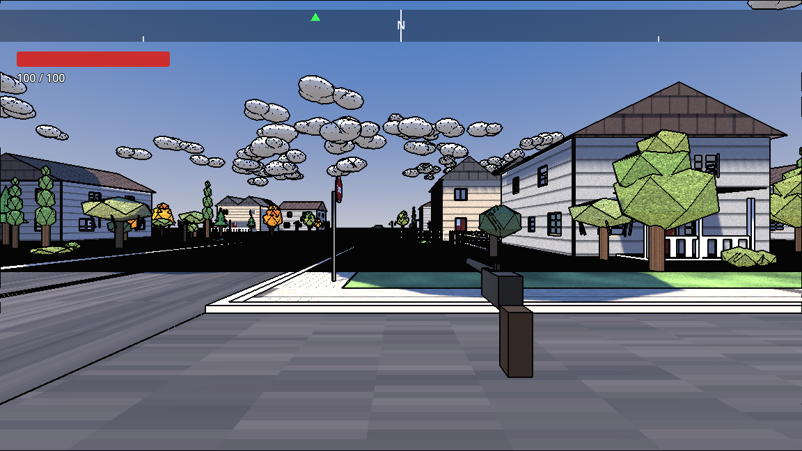

# Goblin Engine

An easy-to-use, Fallout-style RPG creator with AI agent tooling built
in from the ground up — not bolted on after the fact.



## What this actually is

Goblin Engine isn't a game. It's a toolkit for building one, aimed at a
specific kind of learning: **how to work with an AI agent well enough
to make it operate a system you don't yet understand yourself.**

Every project in this engine ships as a working Godot project plus a
set of tools (`tools/gcmd.py` + an in-game dev bridge) that let an
agent inspect the running game, read pixels off the screen, hot-reload
a shader, wait on frames, and drive the game world directly — the same
tools this project was built with. You don't learn the engine by
reading API docs first. You learn it by handing your agent an
unfamiliar toolset and a story to build, and figuring out — together —
how to get from "here's what I want" to "here's how the engine actually
does it."

The point isn't the story you end up with. It's what you learn about
directing an agent along the way: how to describe a goal precisely
enough to be useful, how to tell when an agent's confident answer is
actually wrong, how to verify a claimed fix instead of trusting it, and
how to manage a multi-step build without doing every step by hand
yourself. Finish a project here, and you should walk away with real
confidence that you can point an agent at *some other* unfamiliar
system and get it to do useful, verified work — not just this one.

## The sample story

The engine ships with one complete example: a first-person RPG set on
a fictionalized Lloyd St, Akron OH, under siege by a bedbug
infestation. It's playable, has NPCs, a day/night cycle, a
comic-book-style cel-shaded renderer with screen-space outlines, and a
non-linear structure — there's no single correct order to clear it.

That story is a demonstration, not the destination. It exists to show
what the engine can already do and to give you a concrete, working
starting point. The intended path is to point your own agent at it and
tell it to bend the story somewhere new — a different setting, a
different threat, a different shape of non-linearity — using the same
tools and the same engine underneath.

## Download

Pre-alpha, built via headless CLI/scripting (no Godot editor GUI
sessions) — see [Releases](https://github.com/GoblinGameEngine/goblin-engine/releases)
for every build. Latest:

- **Linux (x86_64)** — [goblin-engine-linux-x86_64.tar.gz](https://github.com/GoblinGameEngine/goblin-engine/releases/latest/download/goblin-engine-linux-x86_64.tar.gz).
  Extract, `chmod +x goblins.x86_64`, run it from that directory.
  Needs a Vulkan 1.2-capable GPU (Godot 4's Forward+ renderer).
- **Raspberry Pi 5 (preview, untested on hardware)** — native tarball
  and Flatpak on the [`pi5-preview-1`](https://github.com/GoblinGameEngine/goblin-engine/releases/tag/pi5-preview-1)
  release. Real risk it runs poorly on the Pi 5's GPU — that's exactly
  what this build is testing.

## License

All rights reserved for now (see `LICENSE`) — this repo is public so
it's visible and testable, not because it's open source yet. A
permissive license is planned once the project reaches a usable state.

## Version

**Current: `0.6.1-prealpha.14`** — pre-alpha. Tracked in the `VERSION`
file at the repo root (single source of truth) and mirrored into
`godot_project/project.godot`'s `config/version`.

Scheme: `MAJOR.MINOR.PATCH-phase.N`, phase one of `prealpha` / `alpha`
/ `beta` / `rc`, dropped entirely at `1.0.0` (first real release):
- `MAJOR.MINOR.PATCH` bumps like normal SemVer — patch for fixes, minor
  for new features, major reserved for 1.0.0 and later breaking changes.
- `N` is a counter within the current phase, bumped on each tagged push
  during that phase (`prealpha.1`, `prealpha.2`, ...).
- Advancing phases (e.g. pre-alpha → alpha) resets `N` to `1` and is a
  deliberate call, not automatic — currently pre-alpha until told
  otherwise.

Each versioned push is tagged in git as `v<version>` (e.g. `v0.1.0-prealpha.1`).

## Repo layout

- `godot_project/` — the sample story: a full Godot 4 project (scripts,
  shaders, scenes, assets), buildable and playable on its own.
- `tools/` — the agent-facing dev tools: `gcmd.py` (a TCP client) talks
  to `DevBridge.gd` (an autoload in the running game) to inspect state,
  read pixels, hot-reload shaders, and drive the game headlessly.
  `regression_check.sh` runs a full reimport + headless boot + sanity
  check in one command.
- `scenes/*.blend` — the Blender source files behind the sample story's
  assets, built via headless Python scripts (no manual modeling
  sessions) so the whole pipeline is reproducible.
- `reference/` — local development notes, excluded from git.

## GitHub

Repo: **https://github.com/GoblinGameEngine/goblin-engine** (public)

Pushed with `gh` CLI, authenticated as the `GoblinGameEngine` account.

`.gitignore` excludes, deliberately:
- `/reference/` — personal photos and character-reference images used
  as source material while building assets, not meant to be published.
  Kept local-only.
- `godot_project/.godot/` — Godot's editor cache/import artifacts,
  fully regenerated automatically on next open.
- `godot_project/build/` — exported game binaries, regenerate via
  Godot's export, not source.
- `*.blend1` / `*.blend2` — Blender autosave backups.
- `/godot/` — a spare local copy of the Godot engine binary, not
  project code.

Everything else (scripts, scenes, textures, `.blend` project files,
tools) is committed.

### Git identity

This repo's commits use `GoblinGameEngine <GoblinGameEngine@users.noreply.github.com>`
as the author, set locally for this repo only — it does not affect your
global git config or any other project.

### Pushing future changes

```bash
cd ~/goblin-engine
git add -A
git commit -m "..."
git push
```
